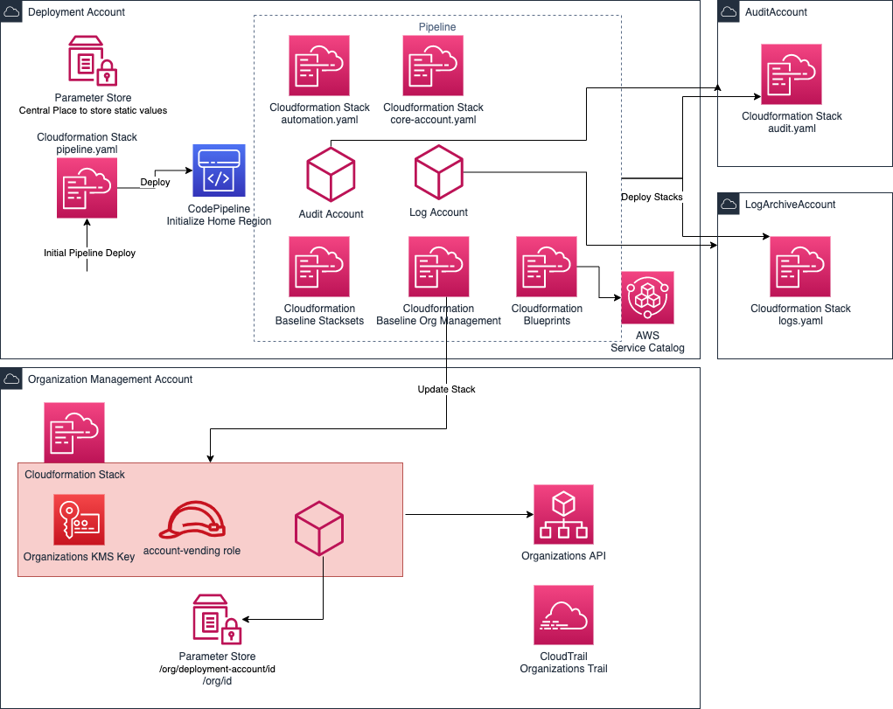

# AWS Enterprise Jumpstart (EJS)

Enterprise Jumpstart is a cloud foundation/landing-zone framework with transparency & simplicity in mind. It establishes governance and control for enterprise multi-account cloud environment by utilizing AWS Organization and AWS native APIs only. It automates the deployment of an enterprise cloud foundation including central logging & cross-account security audits, account blueprints, versioning & provisioning, security & compliance guardrails.

## Features

* Curated preventive guardrails via AWS Organizations Service Control Policies
* Central logging via AWS Cloudtrail, AWS Config and AWS Organizations
* Encryption at rest via AWS Key Management Service
* Modular codebase with no additional upstream project codebase to maintain
* Concurrent AWS Account Provisioning via AWS Service Catalog and AWS Cloudformation
    * Blueprinting
    * Versioning
    * Staging and bulk upgrades
    * Alerting of provisioning failures via AWS Simple Notification Service (SNS)
* Custom preventive and detective guardrails
* AWS Cloudformation Infrastructure as Code support
    * Preventive (Service Control Policies) guardrails on organizational unit level
    * Detective (AWS Config) guardrails on organizational unit level
    * Account level tags
* Transparent troubleshooting simplified via AWS Cloudformation Event Log and AWS Cloudwatch Logs

### Future Plans

* Automated deployment & merge of upstream improvements with Enterprise Jumpstart
* Additional AWS Cloudformation support
    * AWS Alternate Account Contacts via AWS Service Catalog Account Blueprints
* Enhanced monitoring
* Additional Cloudformation Baseline Stacksets
    * Curated Config Rules
    * AWS Systems Manager Parameters

## Tenets - Unless you now better ones

* Security
* Simplicity
* Transparency & Flexibility
* Scalability

See details on tenets & our vision in (docs/tenets-and-vision.md)[docs/tenets-and-vision.md]

## Pre-requisites

* Before starting make sure you run an EC2 instance for at least 30min and then terminate it. This is required to create core accounts.
* In parallel request an service quota increase on AWS Accounts per AWS Organization

## Pre-requisite decisions

* Home region
* Governed regions
* Managed Resource Prefix (default `ejs`)
* Email sub-domain, plus-notation, mail addresses for core accounts
* Notification Mail Address

## Jumpstart Deployment Steps

**If not exists applies to all steps**

Use [CHECKLIST.md](CHECKLIST.md) to note down and document required information during the deployment process.

### Perform the following steps within the central organization management account

1. Create AWS Organization and verify the email associated
2. Create `Core`, `Foundation`, `Dev` Organizational Unit
3. Enable Service Control Policies within AWS Organizations
4. Enable Organizations Service Trust on AWS Config and AWS Cloudtrail
   * `aws organizations enable-aws-service-access --service-principal config-multiaccountsetup.amazonaws.com`
   * `aws organizations enable-aws-service-access --service-principal config.amazonaws.com`
   * `aws organizations enable-aws-service-access --service-principal cloudtrail.amazonaws.com`
5. Create dedicated deployment account via AWS organization
6. Move the created deployment account into the Foundation OU
7. Deploy the AWS CloudFormation stack `templates/org-management.yaml` with appropriate parameters, with stack name <ejs-prefix>-base

### Perform the following steps within the newly created deployment account:

1. Create a parameter in AWS Systems Manager Parameter Store for each OU with scheme: `/org/organization-unit/<lowercase-ou-name>`, value: `ou-id` found within AWS Organizations Console
2. Deploy the AWS CloudFormation stack `deployment/pipeline.yaml` with appropriate parameters in the _home_ region
3. Leave Parameter for audit and log account Ids temporary **empty**
4. Walk through all files within `parameter` folder and adapt values (except for strings containing two slash as in orgs)
5. Adopt `scps/metadata.yaml` with correct OU ids
6. Push code to AWS CodeCommit and wait for pipeline succeed
7. Delegate Config Administrator to the Audit Account (to be executed in AWS Organization Account)
   * `aws organizations register-delegated-administrator --account-id 999999999999 --service-principal config-multiaccountsetup.amazonaws.com`
   * `aws organizations register-delegated-administrator --account-id 999999999999 --service-principal config.amazonaws.com`
9. Update the pipeline cloudformation stack with correct audit, log archive account id parameter values
10. Run Automation Pipeline, wait for it being successful
11. Enable AWS CloudTrail Organization Trail in Management Account using bucket created in log archive account and KMS key id found in parameter store
    `aws cloudtrail create-trail --name org-trail --s3-bucket-name cloudtrail-log-archive-<org-id> --kms-key-id <org-kms-key-id> --is-multi-region-trail --include-global-service-events --is-organization-trail --enable-log-file-validation --region <home-region>`
12. Start trail logging: `aws cloudtrail start-logging --name org-trail`

## Jumpstart Big Picture

## Account Provisioning Usage and Documentation

See blueprints, how-to in [docs/](docs)

The following AWS Cloudformation Resource Providers are used within Enterprise Jumpstart

* ProServe::Cloudformation::StackInstances - https://github.com/aws-samples/aws-organizations-account-resource.
* ProServe::Organizations::Account- https://github.com/aws-samples/aws-cloudformation-stack-instances

## AWS Config Suggestions

Add AWS Config Rules to AWS Config Baseline Stackset to cover all accounts provisioned via EJS. Create new StackSet for OU bound config rule set for organziational unit (OU) level rules.

See curated list of AWS Config Rules here: https://github.com/awslabs/aws-config-rules/blob/master/aws-config-conformance-packs/AWS-Control-Tower-Detective-Guardrails.yaml

## Security

See [CONTRIBUTING](CONTRIBUTING.md#security-issue-notifications) for more information.

## License

This library is licensed under the MIT-0 License. See the LICENSE file.
